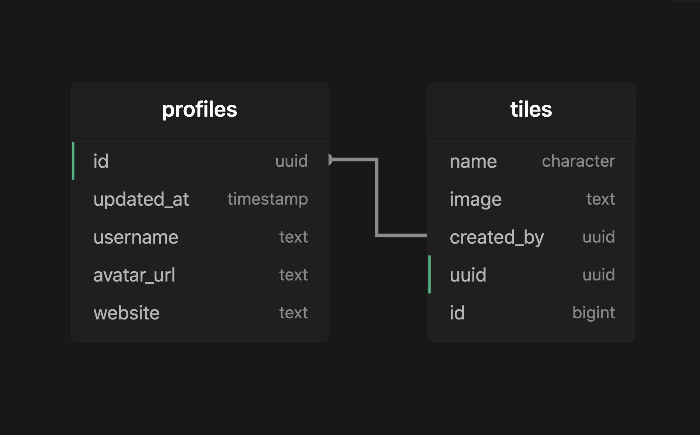

# Speak-Easy

Full-stack Tech For Better project by FAC21 built with Supabase as backend and React as front-end.

# Team

- Sevda
- Mariya

## Database Schema [UI](./src/assets/Schema.png)

---

This project was bootstrapped with [Create React App](https://github.com/facebook/create-react-app).

## Available Scripts

In the project directory, you can run:

### `yarn start`

Runs the app in the development mode.\
Open [http://localhost:3000](http://localhost:3000) to view it in the browser.

The page will reload if you make edits.\
You will also see any lint errors in the console.
