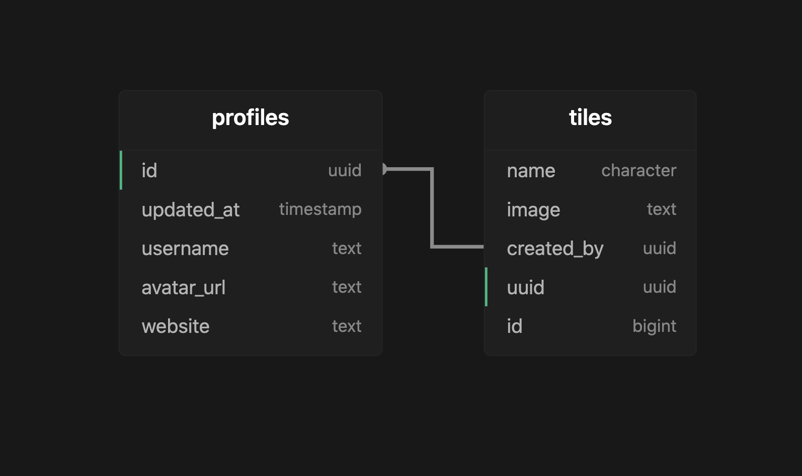

# Speak-Easy

## Project overview

An MVP for Full-stack Tech For Better project by FAC21 built with Supabase as backend and React as front-end.

[Speak-Easy](www.speak-easy.uk) is a predictive text to voice application designed to help people communicate, enhancing their quality of life and independence.

# Developers

- [Sevda](https://github.com/sevdas)
- [Mariya](https://github.com/MariyaPeychinova)

## Contents

- [Project overview](#Project-overview)
- [Developers](#Developers)
- [Tech Stack](#Tech-Stack)
- [Database schema](#Database-schema)
- [Features](#Features)
- [Getting started](#Getting-started)
  - [Database setup](#Database-setup)
- [Project Timeline](#Project-Timeline)
- [Reflections and What Next](#Reflections-and-What-Next)
<!-- - Key takeaways
- ⏳ Additional Features -->

---

## Tech Stack 

Design

Deployed on 

Dependencies

    - supabase
    - react
    - react-dom
    - react-router-dom
    - react-scripts
    - react-speech-kit
    - react-supabase
    - uniqid
    - web-vitals

---

## Database Schema 

[UI](./src/assets/Schema-.png)

---

## Features

What can you do?

- You can sign up as a user typing your email address, clicking on the Magick Link and following the link provided in the email received from Supabase.

- 

- 

- 

---

## Getting started

This project was bootstrapped with [Create React App](https://github.com/facebook/create-react-app).

- Navigate to [repo](https://github.com/tech-for-better/Speak-Easy)
- Clone it with `git clone https://github.com/tech-for-better/Speak-Easy.git` and `cd` into the project folder

### Available Scripts

- ### `yarn` to install all dependencies
- ### `yarn start` to start the server in the browser.

That will run the app in the development mode.\
Open [http://localhost:3000](http://localhost:3000) to view it in the browser.

The page will reload if you make edits.\
You will also see any lint errors in the console.

---

## Database setup

- Create a .env.local file in the root of the project and add the Environment variables provided by Supabase. They can be found in the Project documentation and on Supabase platform under Speak-Easy project, Settings, API.

- To be able to maintain the data in the database you need to sign in the Supabase platform using Speak-Easy Github account. The credentials can be found in the Project documentation.

---

## Project Timeline

### Admin

Project duration: 28 June to 4 August 2021 with a Showcase on 11 August.

- Design sprint: ideation to prototyping.
- Two 6-day build sprints:

### 🎨 Design process \

- Dicovery and definition workshops on [Miro board](https://miro.com/app/board/o9J_l8DTKbM=/?fromRedirect=1).
- The initial prototype can be viewed on [Figma](https://www.figma.com/file/rVkpg0gwaKI7IaBe2XPOcB/Speak-Easy?node-id=0%3A1).

🔧 First Build Sprint \

- First focused on building skeleton of the platform, connecting the database and rendering the data.

- Setting up the Authentication provided by Supabase

- Built functionalities as displaying the selected data and text to voice

- 

🔨 Second Build Sprint \
By the end of the second build sprint, we were able to :

- 
- 
- 

---

## Reflections and What Next

- The remaining tiles need to be imported in the database table `tiles` in the `Table editor` from the folder `tiles` in the bucket `Public` at the `Storage`

- 
